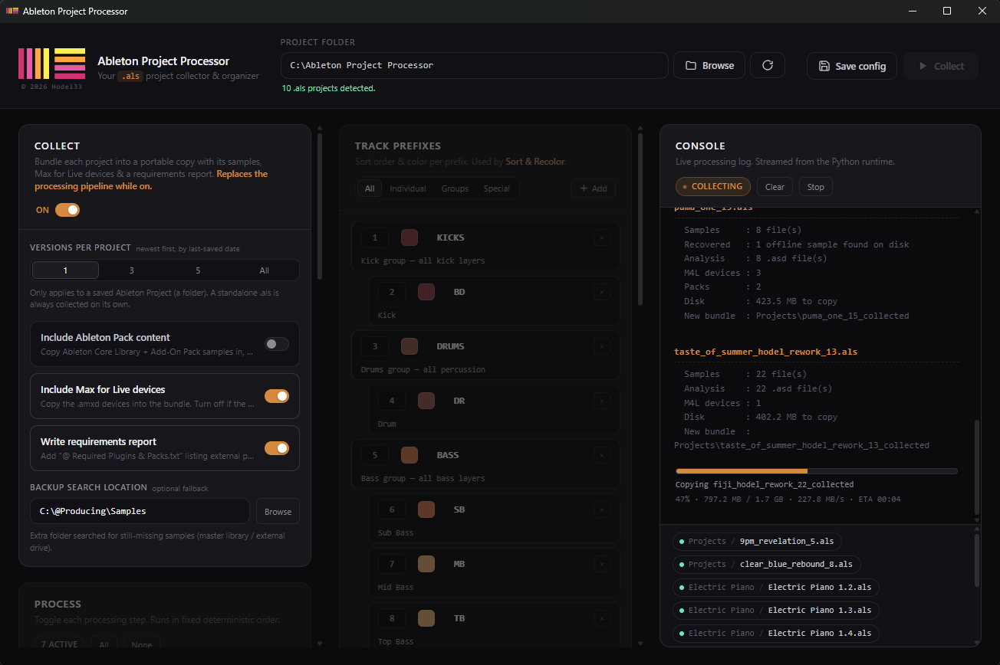
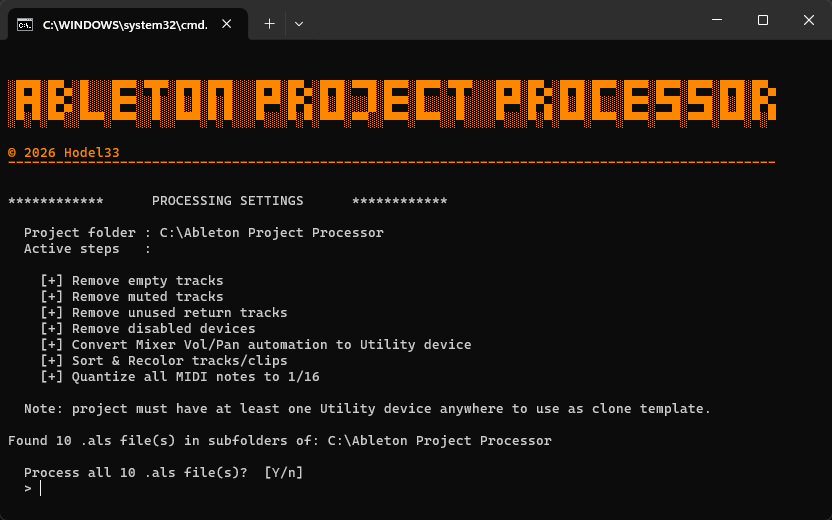
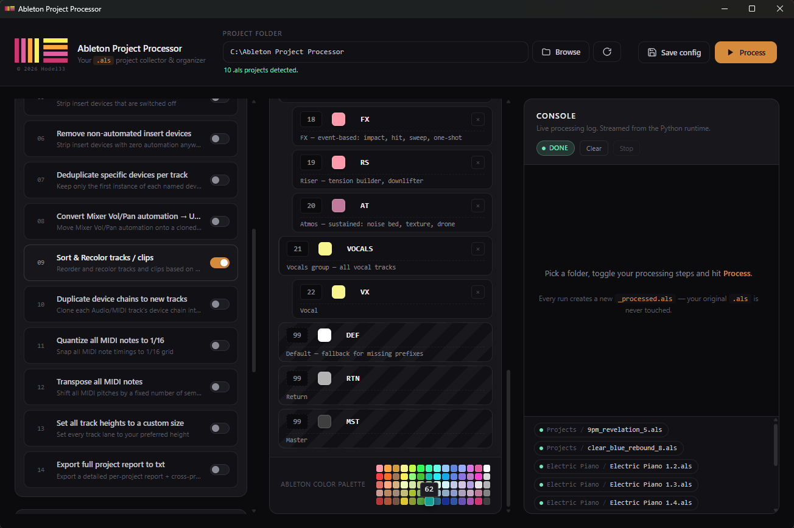
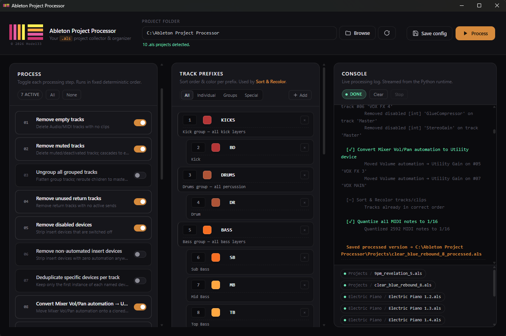

# Ableton Project Processor 🎛️



## 📋 Overview

**Ableton Project Processor** is a swiss-army toolbox for your Ableton `.als` files, working directly on them at the XML level — no Live needed, nothing ever opened in the app. Its standout feature is a **batch "Collect All and Save"**: point it at a folder and every project gets packed into a clean, portable bundle — all its samples, warp files and Max for Live devices copied in and relinked, even ones Ableton had lost — ready to hand off, move to another machine or archive, dozens of projects in the time Live takes to open one. On top of that it **batch-cleans and transforms** your sets: tidy up a chaotic client project, quantize and transpose all MIDI like magic, auto-sort and recolor every track in one pass, strip unused devices, or export a detailed report of every external plugin used across your sessions. Whichever you run, it works on a fresh copy alongside the original — a `_processed.als` or a `_collected` bundle — without ever touching a single knob.

> Curious how it all works under the hood? Have a look at the [🔍 How It Works](#-how-it-works) section further down.

The idea behind all of this came funny enough from a friend ranting about receiving messy Ableton projects from clients (who thought ranting could inspire!? hah). I joked that maybe I could help — and voilà, an Ableton project cleaner was born! It became so much more than that though, more of a swiss army knife now really. Proud of how it turned out! I genuinely hope it helps many of you producers out there.

Cheers to my friends for contributing ideas along the way: Mattia (Nihil Young), Mateusz (Skytech), Sean Tyas, Stefan (Dada Life) and Jonas Hornblad 💜 And a big thank you to Luke Bond, who handed me the first working GUI for this project, inspiring me to take it further and polish it into its final form 🤝

<br>

### 🤔 "Why not just use Ableton's API or one of those existing tools?"

I got this question from Joel deadmau5. Great question — and honestly, the answer is: because none of them do what this does. Every Ableton API requires Live to be running with a project open. There are basically 4 API surfaces out there, and they all share the same hard limitation:

**1. Max for Live (LOM — Live Object Model)**
Runs inside a running Live instance, on the currently loaded project only. Literally its name is "Max for Live" — it requires Live Suite (or the add-on) and executes as a device inside the session. No project open = no API.

**2. Control Surface / Remote Scripts (Python)**
Python scripts that Live launches at startup. They hook into whatever project is currently loaded — designed to simulate a hardware controller. Can't touch files on disk, can't iterate projects.

**3. AbletonOSC / LiveOSC / pylive**
Third-party OSC wrappers around the LOM. Same limitation — they send messages to a running Live instance. Just a network layer over (1) and (2).

**4. "Collect All and Save" / built-in batch**
Ableton has no official batch-processing API. The only known trick is an old macOS Automator workflow that literally opens each project one at a time in Live, waits, runs Collect All and Save, closes it. That's not an API — that's UI automation. Minutes per project, visible, breaks if Live crashes, Mac-only.

---

This script skips all of that and works directly on the gzipped XML inside the `.als` — no Live, no plugins loading, no VST scans, no UI. Just open, read, transform, write. Which means:

- ⚡ **Batch everything** — process a whole folder of projects in seconds, skipping the minutes Live spends launching, scanning plugins and loading each project one at a time
- 🚫 **No Live needed** — runs on any machine, even one without Ableton installed
- 🛡️ **Never touches the original** — writes a fresh copy alongside it (a `_processed.als` or a whole `_collected` bundle), so nothing's ever at risk
- 🤖 **Scriptable** — drop it in a watch folder, a cron job, a CI step; it's just Python

I've always loved the magic of automation — that feeling when you kick off one command and watch a hundred tedious hand-edits just *happen*. This is exactly that, for projects you'd otherwise dread opening. Fast, efficient and it lets you spend the time on the music instead of the housekeeping 🎶

<br>

### 🌟 Features

- **Compatible with Ableton Live 12 & 11**: Fully supports project structures from both versions, with processing steps designed to handle version-specific differences safely

- **No Ableton Required**: Operates entirely on the raw decompressed XML inside `.als` files — no Live installation needed, no project loading

- **Non-Destructive**: The original `.als` is never touched; every run produces a fresh copy alongside it — a `_processed.als` when cleaning, or a `_collected` bundle when collecting

- **Batch "Collect All and Save"**: Ableton's own Collect All and Save makes you open each project in Live, run it and save — one at a time. This does the same job in **batch, without opening Ableton at all**: point it at a folder and every project is packed into a clean, portable folder — all its samples, warp files and Max for Live devices copied in and relinked, ready to hand off, move to another machine or archive. It even tracks down samples Ableton has lost and pulls them back in (see [📦 Collect](#-collect--batch-collect-all-and-save))

- **Batch Processing**: Point the GUI or the terminal launcher at a root folder and every `.als` found in its subfolders gets processed in one run

- **Modern GUI Launcher**: A sleek desktop app alongside the command-line workflow — every step and option laid out at a glance, no `config.ini` editing required, and a far more visual and user-friendly way to set up the Sort & Order prefix list

- **Modular Processing**: Toggle each processing step On or Off independently — either visually in the GUI or by editing `config.ini` — run only what you need, in a fixed deterministic order

- **Track Cleaning**: Remove empty tracks, muted tracks and return tracks with no active sends — with automatic cleanup of orphaned send holders and empty groups left behind

- **Device Management**: Remove disabled devices, strip insert devices that have no automation anywhere in the project and deduplicate specific named devices per track — all with guards to protect sound sources and automated on/off toggles

- **Mixer Automation → Utility**: Lift Volume and Pan automation off the Mixer and onto a cloned Utility device inserted directly in the track chain, keeping automation intact and values perfectly mapped

- **Track Organisation**: Sort tracks into a custom prefix-based order and recolor both tracks and their clips in one pass — groups and children handled as atomic units, children without their own prefix inherit the group color

- **MIDI Tools**: Quantize all note timings to a 1/16 grid and/or transpose the entire project by a fixed number of semitones, with automatic pitch clamping and configurable prefix exclusions to protect drum/fx tracks for example

- **Device Chain Duplication**: Clone every Audio and MIDI track's device chain into a new track inserted directly below — clips and automation stripped, custom suffix appended to the name

- **Ungroup Tracks**: Flatten all group tracks in one step — child routing redirected to the master bus

- **Set Track Heights**: Set every track lane to your preferred height in one pass

- **Per-Project Reports**: Export a detailed `_report.txt` for every project covering BPM, time signature, locators, full track and device breakdowns, external plugin list and warning flags for muted/frozen/unnamed/duplicate tracks

- **Global Plugin Aggregation**: If more than one project is found, automatically compile an `@ External Plugins List.txt` across all processed projects — showing every unique external plugin used and a cross-project usage breakdown to spot shared dependencies at a glance

<br>

## ⚙️ Installation

1. 🐍 **Install Python 3.11+**
   - Download and install the latest version from [python.org](https://www.python.org/downloads/)
   - **Windows tip**: During installation, check **"Add Python to PATH"**
   - Verify installation by opening a terminal and running:
     ```bash
     python --version     # Windows
     python3 --version    # macOS
     ```

2. ⬇️ **Download the app** — the easy way:

> 📦 [**Download as ZIP**](https://github.com/hodel33/ableton-project-processor/archive/refs/heads/main.zip) → **unzip it** → done. Everything's already arranged inside — you don't move or rename any files.

That's the whole setup — to run it, head to [🚀 Usage](#-usage) below (macOS needs a quick one-time unlock the first time).

3. **What's in the folder & how it scans** — both launchers scan `.als` files **recursively** from a root folder, skipping anything inside a `Backup/` folder or ending in `_processed.als`. The only difference is which folder counts as the **root**:

   - **Terminal** — the folder containing the script (fixed).
   - **GUI** — whatever folder you pick in the UI.

```
   ableton-project-processor-main/     ← what the ZIP unzips to (rename if you like)
   ├── ableton_project_processor.py    ← the main script (terminal version)
   ├── als_core.py                     ← shared .als basics
   ├── pipeline.py                     ← the Processing steps
   ├── collect.py                      ← the Collect feature
   ├── config.ini                      ← your settings & options
   ├── gui.py                          ← the desktop-app version
   ├── gui/                            ← its assets (HTML / CSS / JS)
   ├── run.bat / run.command           ← terminal launcher (Windows / macOS)
   ├── run_gui.bat / run_gui.command   ← GUI launcher (Windows / macOS)
   └── MySongs/                        ← a folder of your projects
       ├── MySong_1.als                ← scanned
       ├── MySong_1_processed.als      ← ignored (already processed)
       ├── Deeper/
       │   └── MySong_2.als            ← scanned (any depth)
       └── Backup/
           └── MySong_bak.als          ← ignored (inside Backup/)
```

> 💡 You only need the launcher(s) for your OS (`.bat` for Windows, `.command` for macOS). The GUI is optional — if you only want the terminal workflow, the `gui.py` + `gui/` folder + `run_gui.*` files aren't needed.

<br>

## 🚀 Usage

Two ways to run: 
- **GUI** (point-and-click, visual step toggles, live log)

- **Terminal** (reads `config.ini` directly). 

Both run the exact same engine — processing and Collect alike — so pick whichever fits your workflow.

<br>

### 🖥️ GUI

A webview app — pick a project folder, toggle your steps, tweak settings, choose your track prefix config, press **Save config**, then hit **Run**. No `config.ini` editing required; the GUI reads and writes it for you.

> ⏹️ **Stop any time** — both a processing run and a Collect run can be halted mid-way with the **Stop** button. It never cuts off in the middle of writing a file: it finishes what it's on (the current file while processing, the current project during Collect) and stops cleanly before the next.

#### 🪟 Windows
Double-click `run_gui.bat`. On first launch, `pywebview` is installed automatically (takes ~30s).

#### 🍎 macOS
Double-click `run_gui.command`. On first launch, two external libraries `pywebview` + `pyobjc` are installed automatically (takes ~1 min — `pyobjc` is large).

First-time setup is required once due to macOS security restrictions:

1. Open **Terminal** — either via:
- Spotlight (⌘ + Space → type "Terminal" → Enter)
- or in Finder via **Applications → Utilities → Terminal**
2. Type `cd ` (with a trailing space), then **drag the project folder** (the one containing `run_gui.command`) into the Terminal window — macOS will auto-fill the full path. Hit **Enter**. You're now inside the folder.
3. Run these two commands:
```bash
   chmod +x run_gui.command
   xattr -d com.apple.quarantine run_gui.command
```
4. Close Terminal — from now on just double-click `run_gui.command` to launch

<br>

### 💻 Terminal

Configure your steps — or switch on Collect — in `config.ini`, then launch the script. It prints a summary of what it's about to do (the processing steps, or the Collect settings) and asks to confirm — press `ENTER` (or `y`) to proceed, `n` to cancel.



#### 🪟 Windows
Double-click `run.bat` — that's it.

#### 🍎 macOS
Same first-time unblock steps as the GUI — see the [🍎 macOS section under GUI](#-macos) above, just substitute `run.command` wherever `run_gui.command` is mentioned.

<br>

## 🔧 Configuration

All behaviour is controlled by `config.ini` in the same directory as the script.

> 💡 The GUI reads and writes this file for you — so you can safely skip this section if you stick to the GUI.

### `[COLLECT]` — Collect mode

The master mode switch. When `enabled = true`, the run **collects** instead of processing — the whole `[PIPELINE]` below is skipped. See [📦 Collect](#-collect--batch-collect-all-and-save) for what it does.

```ini
[COLLECT]
enabled                = true    # master switch: this run collects instead of processing
versions               = 1       # how many recent versions per project to collect: 1 | 3 | 5 | all
collect_ableton_packs  = false   # also copy in samples from Ableton's Core Library + Add-On Packs
collect_m4l_devices    = true    # copy Max for Live devices (.amxd) into the bundle
write_report           = true    # write "@ Required Plugins & Packs.txt" inside each bundle
backup_search_location = C:\Samples  # optional folder to search for missing samples (e.g. your master library or an external drive)
```

- `enabled` — `true` switches this run to Collect mode; `false` runs the normal cleaning pipeline.
- `versions` — for a project folder holding several saved versions, how many of the most recent `.als` files to collect: `1`, `3`, `5`, or `all`.
- `collect_ableton_packs` — `true` also copies in samples from Ableton's Core Library and Add-On Packs, making the bundle fully standalone; `false` leaves them out (the report lists which Packs are needed). Off by default, since most people already have those Packs.
- `collect_m4l_devices` — `true` (the default) copies each project's Max for Live devices (`.amxd`) into the bundle. Set `false` if the target machine (or your collaborator) already has your M4L devices — they're then left out and the report lists which ones are needed. On by default, since M4L devices are often custom/third-party and *not* something the other side is guaranteed to have.
- `write_report` — `true` (the default) writes a short `@ Required Plugins & Packs.txt` inside each bundle (next to the collected `.als`), listing the plugins and Packs the project needs; set `false` to skip it.
- `backup_search_location` — an optional extra folder (your master sample library, an external drive…) to search when a sample has gone missing. Leave blank to skip.

### `[PIPELINE]` — Toggle steps on/off

Set each step to `true` or `false`:

```ini
[PIPELINE]
remove_empty_tracks                  = false  # Remove Audio/MIDI tracks with no clips
remove_muted_tracks                  = false  # Remove muted/deactivated tracks
ungroup_tracks                       = false  # Flatten all group tracks
remove_unused_return_tracks          = false  # Remove return tracks with no active sends
remove_disabled_devices              = false  # Remove insert devices that are turned off
remove_non_automated_devices         = false  # Remove insert devices with no automation
deduplicate_devices                  = false  # Remove duplicate instances of named devices per track (set in SETTINGS)
convert_mixer_automation_to_utility  = false  # Move Mixer Vol/Pan automation onto a cloned Utility device
sort_color_tracks                    = false  # Reorder and recolor tracks based on prefixes (set in TRACK_PREFIXES)
duplicate_device_chain               = false  # Clone each track's device chain into a new track below
quantize_midi_notes                  = false  # Snap all MIDI note timings to 1/16 grid (set exclusions in SETTINGS)
transpose_midi_notes                 = false  # Shift all MIDI pitches by a fixed number of semitones (set in SETTINGS)
set_track_heights                    = false  # Set all track lane heights to a custom size (set in SETTINGS)
get_project_report                   = false  # Export a full project report to txt
```

### `[SETTINGS]` — Step-specific parameters

```ini
[SETTINGS]

dedupe_devices           = ott, saus    # Device names to deduplicate (comma-separated) — case-insensitive, partial names work (e.g. 'saus' matches 'Sausage Fattener')
exclude_conversion_types = RTN, MST		# Exclude Return (RTN) and/or Master (MST) from conversion
duplicate_chain_suffix   = ' [chain]'   # Suffix appended to duplicated track names
exclude_midi_prefixes    = DRUMS,DR,FX  # Track prefixes to skip during quantize & transpose
transpose_semitones      = -12          # Semitone shift for MIDI notes (e.g. +2, -3, -12)
lane_height              = 68           # Track height — must be a multiple of 17 (range: 17–425)
```

### `[TRACK_PREFIXES]` — Sort order & colors (used by `sort_color_tracks`)



> 💡 The prefix list below is just a starting point of one workflow — feel free to completely make it your own. Change sort orders, swap colors, add new prefixes or remove ones you don't need. It's fully yours to customize.
>
> A color palette reference is included at the bottom of the section — but to find the exact color index for a specific color, just check it directly in Ableton and note the corresponding number.

Each prefix maps to a sort position and an Ableton color index (0–69). Two types of prefixes are supported — 2-letter prefixes for individual tracks and full uppercase words for group tracks:

```ini
[TRACK_PREFIXES]
# ───  Individual: 2-letter | Group: uppercase full word  ────────────
KICKS       = 1, 56     # Kick group — all kick layers
BD          = 2, 56     # Kick

DRUMS       = 3, 57     # Drums group — all percussion
DR          = 4, 57     # Drum

BASS        = 5, 15     # Bass group — all bass layers
SB          = 6, 15     # Sub Bass
MB          = 7, 1      # Mid Bass
TB          = 8, 1      # Top Bass

SYNTHS      = 9, 6      # Synths group — leads, plucks, arps, pads
LD          = 10, 6     # Lead
PL          = 11, 6     # Pluck
AR          = 12, 6     # Arp
PD          = 13, 61    # Pad

INSTRUMENTS = 14, 21    # Instruments group — keys, orchestral (real instruments)
KY          = 15, 21    # Keys — piano, organ, electric piano, rhodes, synth keys
OR          = 16, 23    # Orchestral — orchestral instruments except Keys

EFFECTS     = 17, 0     # FX group — all FX, risers, atmos
FX          = 18, 0     # FX — event-based: impact, hit, sweep, one-shot
RS          = 19, 0     # Riser — tension builder, downlifter
AT          = 20, 54    # Atmos — sustained: noise bed, texture, drone

VOCALS      = 21, 3     # Vocals group — all vocal tracks
VX          = 22, 3     # Vocal

# ───  Special track types (by type, not prefix)  ──────────────────
DEF 	    = 99, 13	# Default — fallback for missing prefixes
RTN 	    = 99, 41	# Return
MST 	    = 99, 69	# Master

# ─── Ableton color palette reference (5 x 14) ────────────────────
# Col 1      (0, 14, 28, 42, 56)                   →  Red / Pink
# Col 2-3    (1-2, 15-16, 29-30, 43-44, 57-58)     →  Orange / Brown
# Col 4-6    (3-5, 17-19, 31-33, 45-47, 59-61)     →  Green / Yellow
# Col 7-10   (6-9, 20-23, 34-37, 48-51, 62-65)     →  Blue / Cyan
# Col 11-13  (10-12, 24-26, 38-40, 52-54, 66-68)   →  Purple / Pink
# Col 14     (13, 27, 41, 55, 69)                  →  White / Black
```

> Any track whose prefix doesn't match an entry in the list falls back to `DEF`.

> 💡 If you slip up while editing this list — repeat the same prefix, or give two prefixes the same sort position — the app catches it and tells you exactly what's wrong instead of doing something unexpected.

<br>

## 🎚️ Processing Steps Explained



| Step | What it does |
|---|---|
| `remove_empty_tracks` | Deletes Audio/MIDI tracks with no clips |
| `remove_muted_tracks` | Deletes muted/deactivated tracks; cascades to groups that become empty as a result |
| `ungroup_tracks` | Flattens all group tracks; redirects routing to master bus |
| `remove_unused_return_tracks` | Removes return tracks with no active sends; re-indexes remaining send holders |
| `remove_disabled_devices` | Removes insert devices that are turned off; devices with an automated on/off are never removed; first device in chain always kept to protect track volume/pan/send automation |
| `remove_non_automated_devices` | Removes insert devices with no automation anywhere in the project; first device in chain always kept to protect track volume/pan/send automation |
| `deduplicate_devices` | Keeps only the first instance of each named device per track; target names set via `dedupe_devices` — case-insensitive, partial names work |
| `convert_mixer_automation_to_utility` | Moves Mixer Vol/Pan automation onto a cloned Utility device appended at the end of each affected track's chain; Volume → Gain, Pan → Balance (1:1 value mapping); requires at least one existing Utility device anywhere in the project |
| `sort_color_tracks` | Reorders and recolors tracks and their clips based on prefixes in `TRACK_PREFIXES`; groups and children sorted as atomic units; children sorted by their own prefix within each group; children without a matching prefix inherit their parent group's color |
| `duplicate_device_chain` | Clones each Audio/MIDI track's device chain into a new track directly below; clips and automation stripped; `duplicate_chain_suffix` appended to the name |
| `quantize_midi_notes` | Snaps all MIDI note timings to 1/16 grid; set `exclude_midi_prefixes` to skip specific track prefixes (e.g. DRUMS, EFFECTS) |
| `transpose_midi_notes` | Shifts all MIDI pitches by `transpose_semitones`; shift is capped by project-wide min/max note to stay within 0–127; set `exclude_midi_prefixes` to skip specific track prefixes (e.g. DRUMS, EFFECTS) |
| `set_track_heights` | Sets every track lane to your preferred height — set via `lane_height` in SETTINGS |
| `get_project_report` | Exports a full read-only report to `ProjectName_report.txt`; enable this step alone to report on the original unmodified file; if more than one project is found, a shared `@ External Plugins List.txt` is also generated (see [📊 Project Reports](#-project-reports)) |

> **Note:** `convert_mixer_automation_to_utility` requires at least one Utility (StereoGain) device anywhere in the project to use as a clone template.

<br>

## 📦 Collect — Batch "Collect All and Save"

Ableton's built-in **Collect All and Save** is great — but it makes you open a project in Live, run it, save, close, and repeat for *every single project*. There's no batch button anywhere in Ableton for it.

**Collect** does the same job in **batch, without opening Ableton at all**: point it at a folder and every project gets packed into a clean, self-contained folder you can hand off to a collaborator, move to another computer or archive — done straight on the files, no Live, no waiting, dozens of projects in the time Ableton takes to open one.

When Collect is switched on, it **replaces** the cleaning pipeline for that run. For every project it finds, it:

- Copies in **every sample** the project uses, plus the **`.asd`** warp/analysis files that go with them
- Copies in any **Max for Live devices** (`.amxd`)
- **Optionally** pulls in Ableton's own **Factory content** too — Core Library and Add-On Pack samples — when you switch on `collect_ableton_packs`. It's off by default, since anyone with those Packs installed already has them (the requirements report just lists which Packs the project needs); turn it on to make the bundle fully standalone even on a machine without them
- **Relinks** all of it inside the bundle, so the project opens with everything found — no "media files are missing" on the next machine
- **Optionally** writes a short **requirements report** (`@ Required Plugins & Packs.txt`) listing the plugins, Max for Live devices and Ableton Packs you'll need installed on the other machine
- **Checks you have room first** — before copying, it makes sure there's enough free space, and if a project won't fit it skips just that one and tells you, instead of clogging your drive with a half-copied mess
- Never touches your original — the bundle is always a fresh copy

> 🔁 **Safe to interrupt** — if a Collect is stopped or crashes partway, nothing is lost and it never starts over from scratch. Each file is copied safely (written to one side first, then swapped into place), so a crash can never leave a broken half-file behind. Re-run it and it just resumes: samples already copied are recognised and skipped, only the ones still missing are copied, and the `.als` project files are simply rebuilt.

> 📊 **You always see what's happening** — while it works, a live progress bar shows the copy speed and time remaining, and a little spinner keeps turning while it's searching for missing samples, so even a big Collect never looks frozen.

### 🔎 Finding lost samples

If a sample has gone missing — a moved file, a renamed folder, an offline freeze track — Collect doesn't just give up. It searches your disk for it: first around the project itself, then in the folders your other samples came from, and finally in an optional **backup search location** you can point at your master sample library or an external drive. Anything it rescues is pulled into the bundle automatically. Whatever genuinely can't be found is listed clearly **before anything is written**, so you can choose to continue (and relink those later in Live) or cancel.

### 🎛️ How to use it

**GUI** — flip the **Collect** switch on (top-left panel), optionally set a **Backup search location**, and hit **Run**. The pipeline options grey out; Collect takes over for that run.

**Terminal** — set `enabled = true` in the `[COLLECT]` section of `config.ini`, then run as usual. Every option is documented under [🔧 Configuration → `[COLLECT]`](#collect--collect-mode).

### 📁 Where things land

Everything the script gathers goes into clearly-named **`Collected`** subfolders — samples into `Samples/Collected/`, Max for Live devices into `Presets/Collected/`. Ableton's own Collect All and Save drops things into folders called `Imported`; using **`Collected`** instead means you can tell at a glance exactly what *this script* pulled in versus what was already part of the project.

What you point it at decides the layout:

- **A loose `.als` file** → becomes its own new `ProjectName_collected/` folder holding the relinked `.als` plus its `Samples/Collected/` and `Presets/Collected/`. A complete, portable bundle you can move anywhere.
- **A real Ableton project folder** (the kind with an `Ableton Project Info` folder next to the `.als`) → filled **in place**, leaving whatever's already inside untouched. Samples that already live inside the project stay exactly where they are — the script only pulls in the ones sitting *outside* the project (plus any Max for Live devices) into `Samples/Collected/` and `Presets/Collected/`. So it just tops up what was scattered elsewhere, without disturbing your existing structure.

> 🗂️ **Multiple versions, one shared copy** — when you set `versions` above `1`, all of a project's collected versions share the *same* `Samples/Collected/` and `Presets/Collected/`. A sample used by several versions is copied just **once** and every version's `.als` is relinked to that single copy — never a duplicate per version. Two different files that happen to share a name are kept apart automatically, and even samples Ableton had lost (and the collector tracked back down on disk) resolve to the one real file. Because the shared samples aren't duplicated, collecting several versions costs little more disk space than collecting one.

### 📄 The requirements report

With `write_report` on, each bundle gets an `@ Required Plugins & Packs.txt` next to the collected `.als` — an at-a-glance list of everything the target machine still needs to open the project fully online: the external plugins used, the Max for Live devices (bundled, but still needing M4L installed to load), and any Ableton Packs whose samples weren't copied in. Here's what one looks like:

```text
════════════════════════════════════════════════════════════
  puma_one_15_collected.als
════════════════════════════════════════════════════════════
  Collected : 2026-07-27 15:33
  Creator   : Ableton Live 12.4.3

════════════════════════════════════════════════════════════
  EXTERNAL PLUGINS
════════════════════════════════════════════════════════════
  Correlometer          VST3
  Decapitator           VST3
  LFOTool_x64           VST2
  OTT                   VST3
  Ozone 12              VST3
  Pro-C 2               VST3
  Pro-L 2               VST3
  Pro-Q 4               VST3
  Saturn 2              VST3
  ShaperBox 3           VST3
  soothe2               VST3
  SPAN                  VST2
  Sylenth1              VST3
  Trackspacer 2.5       VST3
  ValhallaDelay         VST3
  ValhallaVintageVerb   VST3

════════════════════════════════════════════════════════════
  MAX FOR LIVE DEVICES
════════════════════════════════════════════════════════════
  Pitch Pipe            included
  Pyra                  included
  Sting 2               included

  Note: the .amxd files are included in the bundle, but Max for Live must be
  installed to load them (incl with Suite, paid add-on for Standard)

════════════════════════════════════════════════════════════
  REQUIRED PACKS
════════════════════════════════════════════════════════════
  Dystopian Signals by Mind Flux
  Synthwave by ModeAudio

  Note: these samples were not included. Install these Packs on the
  target machine or they will be offline.
```

<br>

## 📊 Project Reports

### Per-project report — `ProjectName_report.txt`

Generated next to the source `.als` file when `get_project_report = true`. The file contains three sections:

- **PROJECT SUMMARY** — Creator, BPM, time signature, locators (with names), track counts by type, return track names, clip counts (MIDI/Audio), total automation envelopes, a device count split into native Ableton devices vs external plugins, and any warning flags: frozen tracks, muted tracks, unnamed tracks, duplicate track names, disabled devices.
- **EXTERNAL PLUGINS** — Alphabetical list of all external (VST2/VST3/AU) plugins used in the project.
- **FULL DEVICE LIST** — Nested device tree per track. Each track line is tagged `[Muted]` and/or `[Frozen]` where applicable, and each device shows its name, `[Off]` if disabled, and `[Auto:N]` if it has N automated parameters.

> 💡 To report on the original unmodified project, enable only `get_project_report` and disable all other steps — the report always reflects the state of the project after any enabled steps have run.

A compact summary is also printed to the console during processing.

```text
════════════════════════════════════════════════════════════
  PROJECT SUMMARY
════════════════════════════════════════════════════════════
  Creator          : Ableton Live 11.2.6
  BPM              : 138.00
  Time signature   : 4/4
  Locators         : 4   (BREAK, MAIN 1, MAIN 2, STOP)

  Total tracks     : 29
    Group          : 2
    Audio          : 9
    MIDI           : 18

  Clips            : 2542 MIDI / 83 Audio
  Automations      : 86
  Frozen tracks    : 1
  Muted tracks     : 15

  Total devices    : 230
    Native         : 68
    External       : 162

  Disabled devices : 39

════════════════════════════════════════════════════════════
  EXTERNAL PLUGINS  (shortened for demo purpose)
════════════════════════════════════════════════════════════
  bx_control V2         VST3
  Decapitator           VST3
  FabFilter Pro-DS      VST2
  Kick 3                VST3
  LFOTool_x64           VST2
  OTT                   VST3
  Pro-C 2               VST3
  Pro-L 2               VST3
  Pro-Q 3               VST3
  Pro-Q 4               VST3
  s(M)exoscope          VST3
  Saturn 2              VST3
  ShaperBox 3           VST3
  soothe2               VST3
  SPAN                  VST2
  SPAN                  VST3
  Sylenth1              VST3
  Trackspacer 2.5       VST3
  ValhallaVintageVerb   VST3
  Wider                 VST3

════════════════════════════════════════════════════════════
  FULL DEVICE LIST  (shortened for demo purpose)
════════════════════════════════════════════════════════════

  [MIDI] #01 Sidechain
  ────────────────────────────────────────
    [int] InstrumentGroupDevice
      [int] ProxyInstrumentDevice
      [int] ProxyInstrumentDevice
      [int] ProxyInstrumentDevice

  [Group] #08 LOW END
  ────────────────────────────────────────
    [ext] SPAN
    [ext] Pro-Q 4 [Off]
    [int] GlueCompressor [Off]
    [ext] SPAN
    [ext] s(M)exoscope
    [ext] Pro-L 2 [Off]

    [MIDI] #09 Kick  3
    ────────────────────────────────────────
      [ext] Kick 3
      [ext] Pro-Q 4 [Off]
      [int] StereoGain
      [ext] ShaperBox 3

    [MIDI] #11 Sub Bass LONG
    ────────────────────────────────────────
      [ext] Sylenth1
      [int] StereoGain
      [ext] bx_control V2
      [ext] Pro-Q 4
      [ext] Decapitator
      [ext] Pro-C 2
      [ext] ShaperBox 3
      [ext] Trackspacer 2.5

  [Audio] #15 Vox Pre FX [Frozen] [Muted]
  ────────────────────────────────────────
    [int] StereoGain [Off]
    [ext] FabFilter Pro-DS [Off]
    [ext] Pro-Q 4
    [ext] Pro-C 2
    [ext] soothe2
    [int] MultibandDynamics [Off]
    [int] Delay [Off]
    [int] Reverb
    [ext] soothe2
    [int] StereoGain

  [Audio] #17 FX Vox
  ────────────────────────────────────────
    [ext] Pro-Q 3
    [ext] Pro-C 2
    [ext] soothe2
    [int] Reverb
    [int] FilterEQ3 [Auto:1]
    [ext] Pro-L 2
    [ext] LFOTool_x64 [Auto:1]

  [MIDI] #19 Pad
  ────────────────────────────────────────
    [ext] Sylenth1 [Auto:1]
    [ext] soothe2
    [ext] Pro-Q 4
    [ext] Pro-C 2
    [ext] Saturn 2
    [ext] ValhallaVintageVerb
    [ext] OTT
    [ext] Pro-Q 4 [Off]
    [ext] Wider
    [int] FilterEQ3 [Auto:1]
    [int] StereoGain
    [ext] LFOTool_x64 [Auto:1]
    [ext] Trackspacer 2.5
```

### Global report — `@ External Plugins List.txt`

Automatically written to the root folder (where the script / GUI launcher lives) after all files have been processed, if more than one `.als` file was found. It aggregates the external plugin data from every `_report.txt` into a header plus two sections:

- **Header** — when the report was generated and the full list of projects it covers, so its scope is clear up front.
- **FULL LIST** — Every external plugin found across all projects, sorted alphabetically.
- **USAGE BY PROJECT** — Plugins grouped by which combination of projects they appear in; useful for spotting shared dependencies or missing installs.

```text
════════════════════════════════════════════════════════════
  @ External Plugins List
════════════════════════════════════════════════════════════
  Generated : 2026-07-27 12:29
  Projects  : 5
    9pm_revelation_5.als
    clear_blue_rebound_8.als
    fiji_hodel_rework_22.als
    puma_one_15.als
    taste_of_summer_hodel_rework_13.als

════════════════════════════════════════════════════════════
  EXTERNAL PLUGINS — FULL LIST
════════════════════════════════════════════════════════════
  Correlometer       VST3
  Decapitator        VST3
  FabFilter Pro-DS   VST2
  kHs Bitcrush       VST2
  kHs Chorus         VST3
  Melodyne           VST3
  OTT                VST3
  Ozone 12           VST3
  Pro-C 2            VST3
  Pro-L 2            VST3
  Pro-MB             VST3
  Pro-Q 3            VST3
  Pro-Q 4            VST3
  s(M)exoscope       VST3
  Saturn 2           VST3
  ShaperBox 3        VST3
  SPAN               VST2
  SPAN               VST3

════════════════════════════════════════════════════════════
  EXTERNAL PLUGINS — USAGE BY PROJECT
════════════════════════════════════════════════════════════
  Pro-C 2, Pro-L 2, Pro-Q 3, SPAN
  → 9pm_revelation_5.als, clear_blue_rebound_8.als, fiji_hodel_rework_22.als,
    puma_one_15.als, taste_of_summer_hodel_rework_13.als

  Saturn 2
  → 9pm_revelation_5.als, fiji_hodel_rework_22.als, puma_one_15.als,
    taste_of_summer_hodel_rework_13.als

  Decapitator
  → clear_blue_rebound_8.als, fiji_hodel_rework_22.als, puma_one_15.als,
    taste_of_summer_hodel_rework_13.als

  FabFilter Pro-DS
  → 9pm_revelation_5.als, clear_blue_rebound_8.als, fiji_hodel_rework_22.als

  Correlometer, OTT, Ozone 12, Pro-Q 4, ShaperBox 3
  → fiji_hodel_rework_22.als, puma_one_15.als,
    taste_of_summer_hodel_rework_13.als

  kHs Chorus, Pro-MB, s(M)exoscope, SPAN
  → fiji_hodel_rework_22.als, taste_of_summer_hodel_rework_13.als

  kHs Bitcrush
  → clear_blue_rebound_8.als

  Melodyne
  → puma_one_15.als
```

<br>

## 🛡️ Safety & Integrity

The cleaning steps look after your project as they go, so a clean-up pass can never accidentally gut a set:

- The track-removal steps **never delete every track** — at least one always stays.
- The device-removal steps **always keep the first device in each track** (your sound source / instrument) and **never leave a track with a completely empty device chain** (Ableton drops a track's volume, pan and send automation if its chain is empty).
- A device is **never removed if its on/off switch is automated** — that means you're using it on purpose.

Before validation, the script runs a silent auto-cleanup pass on the processed XML:

- **Dead automation envelopes** orphaned by removed tracks or devices are automatically removed
- **NextPointeeId** is automatically corrected if it has fallen behind the highest ID in the project

After cleanup, the script runs integrity checks before saving:

- **TrackSendHolder count** matches the remaining return track count
- **No duplicate track IDs** (prevents Ableton's "non-unique list ids" error)
- **No new dangling PointeeIds** introduced by the script — only newly introduced ones block saving
- **No truncated output** — verifies `</LiveSet>` is present at end of file

If any check fails, the issue is printed clearly in the console output and the file is **not saved**.

<br>

## 🔍 How It Works

Here's the trick nobody tells you: an `.als` file is just a **gzipped text file**. Rename any `.als` to `.gz`, unzip it, and you'll find a plain XML document describing every track, clip, device, knob and automation point in your project. Ableton Live reads and writes this XML on save — we just read and write it directly, no Live required.

The script always follows the same pipeline:

1. **Decompress** the `.als` → raw XML text in memory
2. **Process** — run each enabled step (clean, sort, recolor, quantize, etc.) as text/XML transforms
3. **Validate** the result (track IDs unique, returns consistent, no truncation, etc.)
4. **Recompress** the new XML and save it as `ProjectName_processed.als` alongside the original

Your original `.als` is never opened for writing — it's read-only from the script's perspective. If validation fails at step 3, nothing is saved at all.

#### What does the XML actually look like?

Every track in your set is a block like this inside the project XML (trimmed for clarity):

```xml
<MidiTrack Id="12">
  <Name>
    <EffectiveName Value="LD Supersaw" />
    <UserName Value="" />
  </Name>
  <Color Value="14" />
  <DeviceChain>
    <Devices>
      <PluginDevice Id="27">
        <On>
          <Manual Value="true" />
        </On>
        <PlugName Value="Pro-Q 3" />
        ...
      </PluginDevice>
      <Compressor2 Id="28">
        <On>
          <Manual Value="true" />
        </On>
        ...
      </Compressor2>
      <PluginDevice Id="29">
        <On>
          <Manual Value="true" />
        </On>
        <PlugName Value="LFOTool_x64" />
        ...
      </PluginDevice>
    </Devices>
  </DeviceChain>
</MidiTrack>
```

That `<Color Value="14"/>` is the track color index into Ableton's 70-slot palette. `EffectiveName` is the track's display name. `<On><Manual Value="true"/>` tells Ableton whether a device is enabled. Every `Id="..."` is how Ableton links things internally — tracks, devices, automation lanes and return sends all reference each other by these IDs, which is why the script's validation double-checks they stay unique and consistent before saving. When you drag a track, rename it, change its color or bypass a plugin in Live — you're just flipping these same values.

So when the script **sorts and recolors** tracks by prefix, it's rewriting track blocks in order and setting `<Color Value="..."/>`. When it **removes disabled devices**, it finds every device where `<Manual Value="false"/>` and splices that block out. When it **quantizes MIDI**, it rewrites note time values directly. Every step is ultimately "find this piece of text, change or remove it, put the file back together" — except the text happens to be a very structured description of your whole project. Everything the script doesn't explicitly target is left byte-for-byte untouched.

That's the entire magic: Ableton's project format is open enough to edit safely, and the script just does what you'd do by hand — on hundreds of files at once, in a couple of seconds each. And because it's all plain text under the gzip, you never have to take my word for anything — unzip both the original and the `_processed` version, run a diff, and every single change the script made is right there in readable form. No black box.

#### How Collect finds and relinks samples

Every sample in a project is stored as a `<SampleRef>` pointing at a file, with a tiny fingerprint: the original file **name**, its exact **size in bytes**, and a `RelativePathType` flag saying where the file lives — inside the project, in an Ableton Pack, in your User Library, or somewhere external. Collect reads those.

To bundle a project it copies each sample in, then rewrites its `<FileRef>` to say *"this now lives inside the project"* (`RelativePathType` `3`) with a fresh relative path — the exact edit Ableton itself makes when you run Collect All and Save.

And when a sample's saved path is dead, that fingerprint is how Collect goes hunting: it walks your folders looking for a file with the **same name and the exact same byte size** — a match that specific is almost certainly the real file, not a same-named different one. Freeze and recorded files are a special case (Ableton saves them with no size on record), so those fall back to matching by name plus the little folder trail Ableton remembers — enough to grab the right one and never the wrong one. Everything it finds gets copied in and relinked just like the rest, and anything it can't is left honestly listed rather than silently broken.

<br>

## 📜 License

This project is licensed under a Custom License — see the [LICENSE](LICENSE) file for details.

### Summary:

1. **Personal Use Only**: The software may be used and modified for personal, non-commercial purposes only.
2. **No Commercial Use**: The software may not be used for any commercial purposes.
3. **No Distribution**: The software may not be distributed or included in any larger software distributions.
4. **No Sale**: The software may not be sold.

For the full license, please refer to the [LICENSE](LICENSE) file in the repository.

<br>

## 💬 Feedback & Contact

I'd love to network, discuss tech or swap music recommendations. Feel free to connect with me on:

🌐 **LinkedIn**: [Björn Hödel](https://www.linkedin.com/in/bjornhodel)<br>
📧 **Email**: [hodel33@gmail.com](mailto:hodel33@gmail.com)<br>
📸 **Instagram**: [@hodel33](https://www.instagram.com/hodel33)

If you run into any bugs, have feature suggestions or just want to share how you're using the tool — I'd love to hear from you! 💜
